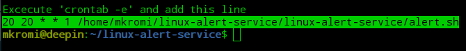

# linux-alert-service


### Installation

Open terminal ( ctrl+alt+t ) and go to __Home__ directory

```bash
cd ~
```

Clone the repository

```bash
git clone https://github.com/mkromi/linux-alert-service.git
```
or download the zip file manually and unzip to __Home__ directory

Change permission to 777

```bash
sudo chmod -R 777 linux-alert-service
```

Go to __linux-alert-service__ directory
```bash
cd linux-alert-service
```

Run __app.sh__ file add your configuration
```bash
./app.sh
```

Copy the line from terminal



Open crontab in edit mode and paste the copied line at the end
```bash
crontab -e
```

The Cron job will run the __alert.sh__ file at specific time of weekdays as given.

### **License**
The **linux-alert-service** is an open-source application licensed under the [MIT License](LICENSE).
